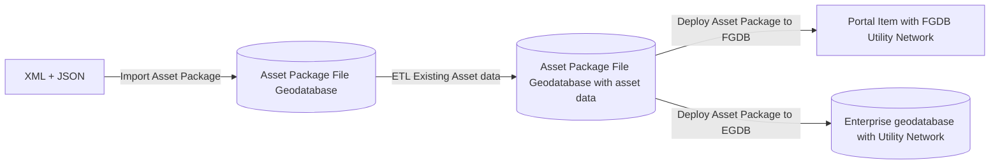

# asset-package-deployment
Automates the deployment of Esri Utility Network using GIT repos and CICD pipelines

## Introduction
This python toolbox can be used to export, import and deploy a Esri Utility Network. Within the Esri technology an asset package containing the Utility Network configuration is stored in a File Geodatabase. Unfortunately, this binary file type doesn't work well in GIT and cannot be maintained by multiple developers at the same time. 
This toolbox aims to solve this problem by translating the File Geodatabase datamodel and data to XML and JSON, which can be stored into GIT repo, the option to load the XML and JSON into a File Geodatabase to allow advanced configurations in ArcGIS Pro and to deploy an Asset package with the asset data to either a File Geodatabase Utility Network or an Enterprise Geodatabase Utility Network.

## Directory Structure GIT

The **Export Asset Package** and **Import Asset Package** work with the following directory structure:

- **xmlworkspace / workspace.xml**: XML description of all featureclasses, tables, domains, etc., from the Asset Package File Geodatabase.
- **unconfiguration**: Contains the data from the A, B, C, D tables from the FGDB. Each table has a JSON file with the records. If columns with Arcade expressions are found, the Arcade expression will be placed in a separate file for better readability.

---

## Import Asset Package
The **Import Asset Package** tool translates the directory from the GIT repository into an FGDB containing the data model and the Utility Network configuration.

---

## Export Asset Package
The **Export Asset Package** tool translates the FGDB containing the data model and the Utility Network configuration into a directory in the GIT repository.  
- If you choose **Full Export**, the workspace XML with the data model is rewritten.  
- If not selected, only the contents of the A, B, C, D tables (UN Configuration) are written.

---

## Deploy Asset Package
The **Deploy Asset Package** tool deploys a populated asset package to a File Geodatabase or an Enterprise Geodatabase. The following parameters must be provided:

- **Asset Package**: The input FGDB Asset Package with data. You can generate this beforehand using Import Asset Package and populate it with FME.
- **Service Territory Feature Class**: Full path to a Polygon Feature Class containing the Service Territory. This can be an SDE file with the feature class name appended after the SDE filename.
- **Output Folder File Geodatabase**: Optional, only use if deploying to FGDB.
- **Output Name File Geodatabase**: Optional, name of the FGDB in this directory, only use if deploying to FGDB.
- **Output SDE File**: Optional, full path to an existing SDE file when deploying to Enterprise Geodatabase.
- **Dataset Name**: Name of the Feature Dataset in the GDB where the UN Feature Classes will be placed.
- **Utility Network Name**: Name of the UN configuration.
- **Domain Networks**: Comma-separated list of domain networks to deploy from the Asset Package.
- **Load Data**: `INCLUDE_DATA` / `SCHEMA_ONLY`.  
  - `INCLUDE_DATA`: Data from the populated AP is also transferred to the database.  
  - `SCHEMA_ONLY`: Data is not transferred.
- **Post Process**: `POST_PROCESS` / `NO_POST_PROCESS`.  
  - Post process runs three processes: enable topology, update subnetworks, and update "Is Connected". Applicable when creating a utility network in a file geodatabase.
- **Configurations**: Select configuration options to apply to your utility network. Applicable when a `D_Configurations` table is present in your asset package. In Python, `*` can be passed to select all configurations.
- **Rename Field**: Select rename options to apply to your utility network. Applicable when the `D_Rename` table is present in your asset package.
- **PortalUrl**: URL of Portal for ArcGIS. Required for EGDB deployment. If provided during FGDB deployment, the FGDB will be uploaded to Portal.
- **PortalUsername**: Portal username that owns the UN in EGDB. If provided during FGDB deployment, the FGDB will be uploaded under this account.
- **PortalPassword**: Password for PortalUsername.
- **Version FCS**: Feature classes/tables not in the Feature Dataset but should be versioned after deployment.

---

## pipeline.py
`pipeline.py` is a Python wrapper for the tools, allowing the parameters defined above to be specified from the command line and to be integrated into platforms like Azure Devops, Github or Gitlab

**Note:**  
For **DeployAssetPackage**, some parameters are read from a config file instead of the command line. This simplifies the command line and allows this part of the configuration to be managed via GIT. See the `deployment-configuration` directory for these configuration files.  
Specify the config file path using `config_file=` when running DeployAssetPackage.  
Portal username and password are always read from environment variables and never passed as parameters for security reasons.

# CICD Integration
To automate the deployment you'll need:
- A build server installed with the agent connected to your platform (Azure Devops, Github or Gitlab). See the documentation of your development platform for more documentation
- An ArcGIS Server installation, when publishing to EGDB, the server should be able to access the database. The script has a dependency on ArcPy and the ArcGIS Server provides this Python module and the required license
- A custom Python ENV with Esri UN-Tools installed, see https://links.esri.com/solutions/UtilityNetworkPackageTools and https://anaconda.org/Esri/untools
- A process to load the existing asset data into the FGDB before you deploy it. You could use FME or you're own Python code to do this

Your pipeline could look like this:
- Create the File Geodatabase from XML and JSON: asset-package-deployment/pipeline.py -o ImportAssetPackage --in_folder=$(System.DefaultWorkingDirectory)\_geo-arcgis-utility-network\asset-package-water --out_workdir="$(System.DefaultWorkingDirectory)" --out_gdb=Assetpackage_Water.gdb
- ETL the existing Asset data into Assetpackage_Water.gdb, resulting in Assetpackage_Water_withdata.gdb
- Deploy the Asset Package with the Asset data to EGDB: asset-package-deployment/pipeline.py -o DeployAssetPackage --in_gdb=$(System.DefaultWorkingDirectory)\Assetpackage_Water_withdata.gdb  --out_sde "$(System.DefaultWorkingDirectory)\egdb.sde" --config_file=$(System.DefaultWorkingDirectory)\_geo-arcgis-utility-network\deployment-configuration\egdb.json   --portalurl=$(portalurl) --user=$(USER) --password=$(PASSWORD)
- Or deploy to a FGDB for testing purposes: asset-package-deployment/pipeline.py -o DeployAssetPackage --in_gdb=$(System.DefaultWorkingDirectory)\Assetpackage_Water_withdata.gdb  --out_folder="$(System.DefaultWorkingDirectory)" --out_gdb=MyUtilityNetwork.gdb --config_file=$(System.DefaultWorkingDirectory)\_geo-arcgis-utility-network\deployment-configuration\fgdb.json --portalurl=$(portalurl) --user=$(USER) --password=$(PASSWORD)

